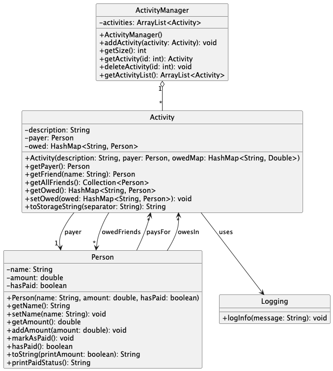
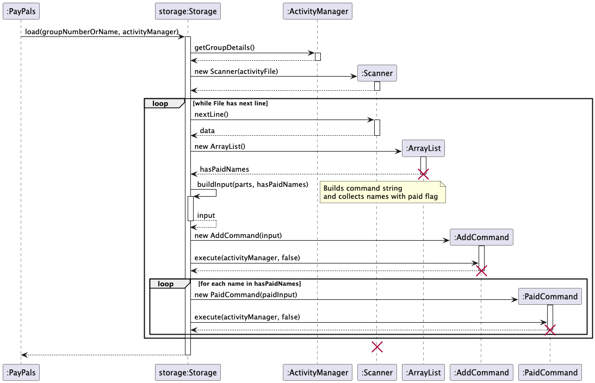

# Developer Guide
## Table of Contents
- [Developer Guide](#developer-guide)
- [Table of Contents](#table-of-contents)
- [Acknowledgements](#acknowledgements)
- [Design \& Implementation](#design--implementation)
  - [Architecture](#architecture)
  - [UI Component](#ui-component)
  - [Parser Component](#parser-component)
  - [Command Component](#command-component)
  - [Activity Component](#activity-component)
  - [Storage Component](#storage-component)
  - [Common Classes](#common-classes)
- [Documentation, logging, testing, configuration, dev-ops]()
- [Appendix: Requirements](#appendix-requirements)
  - [Product scope](#product-scope)
    - [Target user profile](#target-user-profile)
    - [Value proposition](#value-propposition)
  - [User Stories](#user-stories)
  - [Use cases](#use-cases)
  - [Non-functional Requirements](#non-functional-requirements)
  - [Glossary](#glossary)
- [Appendix: Instructions for Testing](#appendix-instructions-for-testing)
  - [Deleting a person]()
  - [Saving data]()

## Acknowledgements

PayPals uses the following tools for development and testing:

1. [JUnit 5](https://junit.org/junit5/) - Used for software testing.
2. [Gradle](https://gradle.org) - Used for build automation.

## Design & Implementation

### Architecture

(edit in docs/diagram/MainArchitecture.puml)
The **Architecture Diagram** given above explains the high-level design of the App.  
  
Given below is a quick overview of the main components and how they interact with each other.  
  
**Main components of the architecture**  
` Paypals` is in charge of the app launch and shut down.  
- At app launch, it initializes the other components in the correct sequence, and connects them up with each other.
- At shut down, it shuts down the other components and invokes cleanup methods where necessary (?)
  
The bulk of the app's work is down by the following five components:
* `Ui`: The UI of the App.
* `Parser`: Parse user entry as commands
* `Command`: The command executor
* `Activity`: Holds the data of the App in memory
* `Storage`: Reads data from, and writes data to, the hard disk.
     
**How the architecture components interact with each other**  
The *Sequence Diagram* below shows how the components interact with each other for the scenario where the user issues the command ``  
  
### UI Component

{Add details of UI here}

### Parser Component

{Add details of Parser here}

### Command Component

<ins>Overview</ins>

The abstract `Command` class has been implemented to introduce an additional layer of abstraction between I/O and command execution, allowing for separation of handling command keywords and executing commands.

The `Command` class has been subdivided into further packages for similar commands, such as `AddCommand` and `DeleteCommand`.

<ins>Implementation Details</ins>

The following diagram is an inheritance diagram for `Command` and its children classes. This has been heavily simplified to show just the high level overview.


<ins>Attributes</ins>

The abstract class `Command` have the following attributes:

* *command*: String containing the command that was input by the user.

<ins>Methods</ins>

The abstract class `Command` have the following methods:

* *Command*: Constructor that updates the `command` attribute based on its input argument.
* *execute*: Method that is overridden by its child classes to fit their functionalities.

### Activity Component
<ins>Overview</ins>

The Activity component models shared expenses in PayPals. It stores the activity description, the payer, and a list of people who owe money. 

The ActivityManager class manages a list of these activities, while the Person class represents individuals involved.

<ins>Implementation Details</ins>

The following diagram shows the key classes in the Activity component and their relationships. This has been simplified to highlight the core data model:



### Storage Component

<ins>Overview</ins>

The `Storage` class is responsible for managing the loading and saving of data of transactions and activities from and onto the local machine. `PayPals` will load the saved data from a save file right after starting the application, and saves all the data back into the save file when the application is exited.

<ins>Implementation Details</ins>

`Storage` will create `savefile.txt` and store in under the directory `./data`. The file format is as follows, with samples provided.

```
DESCRIPTION|PAYER|AMOUNT|HASPAID|FRIEND|AMOUNT|HASPAID...
```


The following is the sequence diagram for loading data from the save file into the `ActivityManager`.



<ins>Attributes</ins>

* *SEPARATOR*: String containing the ASCII character 31 which is an untypable character and used as the separator when storing data in the save file.
* *SAVE_FILE_STRING*: String representing the name of the save file.
* *storageFolderPath*: String representing the path of the `data` directory which contains the save file.
* *activityFile*: A File object representing the `savefile.txt` file.
* *scanner*: A Scanner object used for reading the data from the save file.

<ins>Methods</ins>

* *Storage*: Creates the relavant storage directory and file if it does not exist, while initializing the attributes of the object.
* *save*: Goes through each `Activity` in `ActivityManager` and saves its data in the save file.
* *load*: Reads the save file line by line with the `Scanner` object and load the data into `ActivityManager`.
* *processLine*: Processes a single line of the save file to be loaded.
* *buildInput*: Builds the command input string from the parts obtained in the save file, while also recording each `Person` that `hasPaid` is `true`.
* *executeAddCommand*: Creates and executes the add command to load the data from a specific `Activity` into `ActivityManager` based on the input string.
* *executePaidCommand*: Creates and executes the paid command for each name in a specific `Activity`
* *deleteDir*: Recursively delete a directory and all its contents.

## Appendix: Requirements

### Product scope

#### Target user profile:
- has a need to manage expenses when travelling with friends
- prefer desktop apps over other types
- prefers typing to mouse interactions
- is reasonably comfortable with CLI apps

This product is for university students who frequently travel with friends.

#### Value proposition

The product aims to provide assistance in simplifying payments by minimising the number of transactions needed to balance expenses.

### User Stories

| Version | As a ...                          | I can ...                                                         | So that I ...                                               |
|---------|-----------------------------------|-------------------------------------------------------------------|-------------------------------------------------------------|
| v1.0    | student                           | add an expense and specify who paid and who owes                  | can keep track of spending                                  |
| v1.0    | student who paid for a whole meal | split expenses                                                    | can fairly divide shared costs based on consumption         |
| v1.0    | user                              | delete an expense                                                 | can get rid of an incorrect entry                           |
| v1.0    | user                              | mark expenses as settled or unsettled                             | can keep track of cleared debts                             |
| v1.0    | user                              | view the expenses                                                 | know how much I owe or how much someone owes me             |
| v1.0    | user                              | save current expenses when I exit the application                 | can view them again when I run the application another time |
| v2.0    | new user                          | use a command to display all the common commands and their syntax | know how to use the app                                     |

### Use cases
(For all use cases below, the **System** is `Paypals` and the **Actor** is the `user`, unless specified otherwise)
### Use case: Delete an expense  
  
**MSS**
1. User requests to list expenses
2. Paypals shows a list of expenses
3. User requests to delete a specific expense in the list
4. Paypals deletes the expense
  
&ensp; &ensp; Use case ends  
  
**Extensions**
- 2a. The list is empty.  
    Use case ends.
- 3a. The given index is invalid.
  - 3a1. Paypals shows an error message.  
    Use case resumes at step 2.

### Use case: Mark an expense as paid

***MSS***
1. User requests to list expenses
2. Paypals shows a list of expenses
3. User request to mark a specific expenese as paid in the list
4. Paypals marks the expense as paid

&ensp; &ensp; Use case ends

**Extensions**
- 2a. The list is empty.
    Use case ends.
- 3a. The given index is invalid.
  - 3a1. Paypals shows an error message
    Use case resumes at step 2.
    
### Non-Functional Requirements
1. Should work on any mainstream OS as long as it has Java `17` or above installed.
2. Should be able to hold up to 1000(?) expenses without a noticeable sluggishness in performance for typical usage
3. A user with above average typing speed for regular English test (i.e. not code, not system admin commands) should be able to accomplish most of the tasks faster using commands than using the mouse.
4. (add more)

### Glossary

* *Mainstream OS* - Windows, Linux, Unix, macOS
* Payer - The person that has paid for a specific activity for the group.
* Friend - A friend that is part of an activity that owes money to the payer.

## Instructions for testing
* Technical Requirements: Any mainstream OS, i.e. Windows, macOS or Linux, with Java 17 installed. Instructions for downloading Java 17 can be found [here](https://www.oracle.com/java/technologies/downloads/#java17).
* Project Scope Constraints: Data storage is only to be performed locally.
* Quality Requirements: The application should be intuitive and easy to use by a beginner with little to no experience with CLIs.

### Manual Testing

Please view the [User Guide](UserGuide.md) for the full list of UI commands, their related use cases and the expected outcomes.

### JUnit Testing
JUnit tests are written in the [`test directory`](../src/test/java/paypals) and serve to test key methods part of the application.
